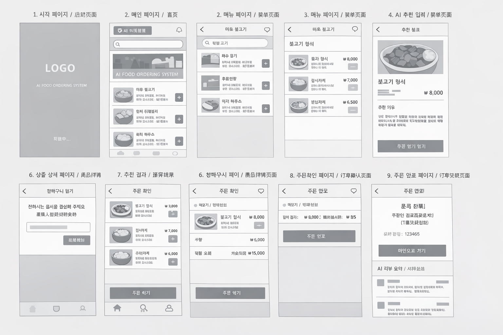

# SWSeoulHexagram
Shinhan University SW SeoulHexagram AI Food Ordering System

지도교수  박진영
멘토        김천웅

소프트웨어공학과	3	남	20242032	장효	비정규	010-5863-7391      
소프트웨어공학과	4	남	20232002	왕추좡	비정규	010-8058-8126      
소프트웨어공학과	4	남	20232003	정흥일	비정규	010-6443-3264      
소프트웨어공학과	3	남	20242031	양혁봉	비정규	010-5726-2165
소프트웨어공학과	3	남	20242043	김가호	비정규	010-5962-7559
소프트웨어공학과	3	남	20242044	이문한	비정규	010-6443-3264

 
 
 
